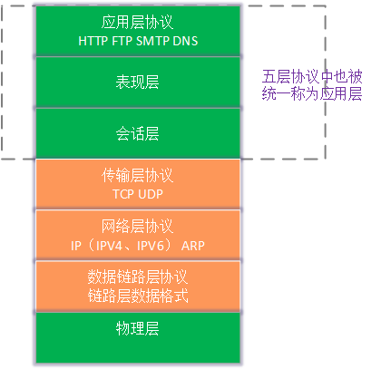
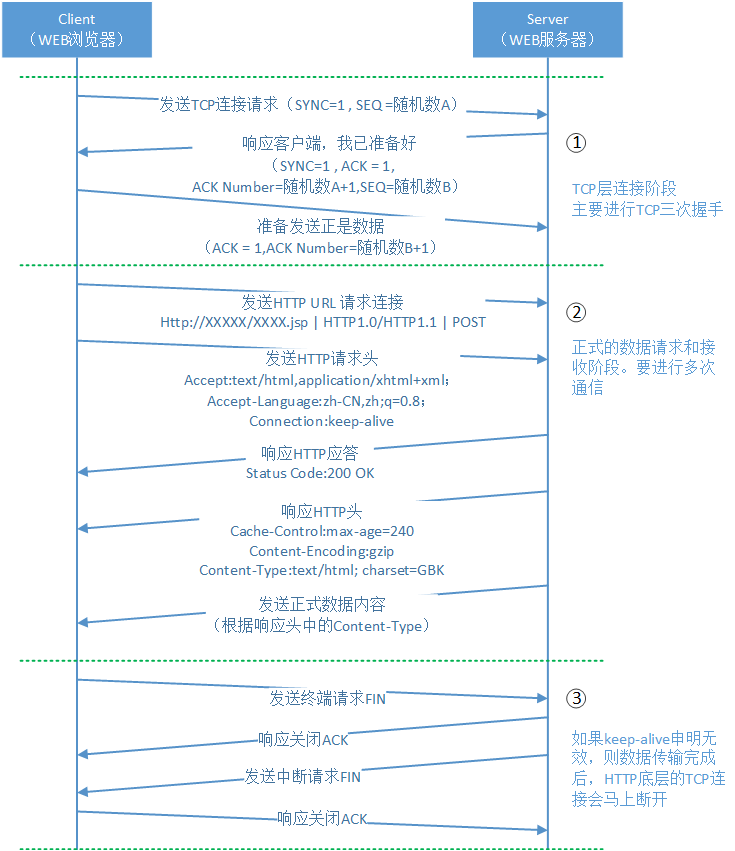

# OSI五层模型 

物理层：物理层就是我们的网络设备层，例如我们的网卡、交换机等设备，在他们之间我们一般传递的是电信号或者光信号。

数据链路层：数据链路又分为物理链路和逻辑链路。物理链路负责组合一组电信号，称之为“帧”；逻辑链路层通过一些规则和协议保证帧传输的正确性，并且可以使来自于多个源/目标 的帧在同一个物理链路上进行传输，实现“链路复用”。

网络层：网络层使用最广泛的协议是IP协议（又分为IPV4协议和IPV6协议），IPX协议。这些协议解决的是源和目标的定位问题，以及从源如何到达目标的问题。

传输层：TCP、UDP是传输层最常使用的协议，传输层的最重要工作就是携带内容信息了，并且通过他们的协议规范提供某种通信机制。举例来说，TCP协议中的通信机制是：首先进行三次通信握手，然后再进行正式数据的传送，并且通过校验机制保证每个数据报文的正确性，如果数据报文错误了，则重新发送。

应用层：HTTP协议、FTP协议、TELNET协议这些都是应用层协议。应用层协议是最灵活的协议，甚至可以由程序员自行定义应用层协议。下图我们表示了HTTP协议的工作方式：

