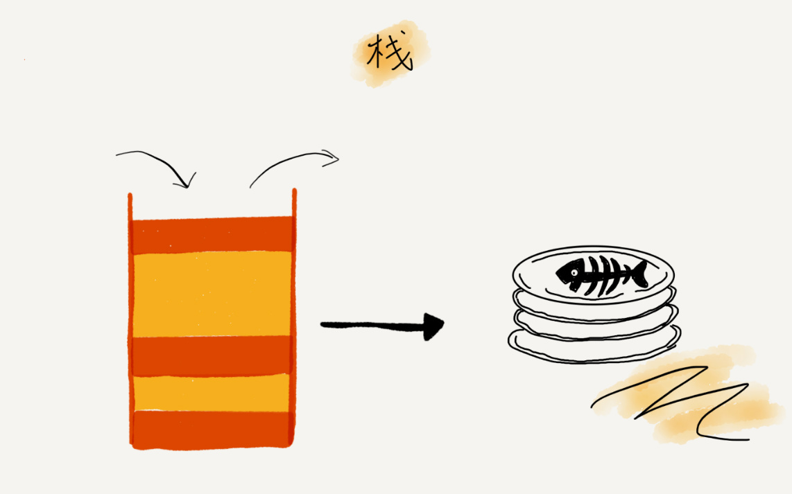

# 栈

栈只允许访问一个数据项：即最后插入的数据项。移除这个数据项后才能够访问倒数第二个插入的数据，依次类推。

特点：后进先出。



从栈的操作特性上来看，栈是一种“操作受限”的线性表，只允许在一端插入和删除数据。

**当某个数据集合只涉及在一端插入和删除数据，并且满足后进先出、先进后出的特性，我们就应该首选“栈”这种数据结构。**

实现栈的示例：

```
// 基于数组实现的顺序栈
public class ArrayStack {
    private String[] items;  // 数组
    private int count;       // 栈中元素个数
    private int n;           // 栈的大小

    // 初始化数组，申请一个大小为 n 的数组空间
    public ArrayStack(int n) {
        this.items = new String[n];
        this.n = n;
        this.count = 0;
    }

    // 入栈操作
    public boolean push(String item) {
        // 数组空间不够了，直接返回 false，入栈失败。
        if (count == n) return false;
        // 将 item 放到下标为 count 的位置，并且 count 加一
        items[count] = item;
        ++count;
        return true;
    }

    // 出栈操作
    public String pop() {
        // 栈为空，则直接返回 null
        if (count == 0) return null;
        // 返回下标为 count-1 的数组元素，并且栈中元素个数 count 减一
        String tmp = items[count-1];
        --count;
        return tmp;
    }
}
```

不管是顺序栈还是链式栈，我们存储数据只需要一个大小为n的数组就够了。在入栈和出栈过程中，只需要一两个临时变量存储空间，所以空间复杂度是O(1)。 

不管是顺序栈还是链式栈，入栈、出栈只涉及栈顶个别数据的操作，所以时间复杂度都是O(1)。 

## 栈的应用

### 函数调用

我们知道，操作系统给每个线程分配了一块独立的内存空间，这块内存被组织成“栈”这种结构,用来存储函数调用时的临时变量。每进入一个函数，就会将临时变量作为一个栈帧入栈，当被调用函数执行完成，返回之后，将这个函数对应的栈帧出栈。为了更好地理解，我们一块来看下这段代码的执行过程。 

```
int main() {
    int a = 1;
    int ret = 0;
    int res = 0;
    ret = add(3, 5);
    res = a + ret;
    System.out.println(res);
    return 0;
}

int add(int x, int y) {
    int sum = 0;
    sum = x + y;
    return sum;
}
```

从代码中我们可以看出，main()函数调用了add()函数，获取计算结果，并且与临时变量a相加，最后打印res的值。如图中显示的是，在执行到add()函数时，函数调用栈的情况。 


### 表达式求值

这里例举计算器中的四则运算：30+15*9+44-12/3。对于这个四则运算，我们人脑可以很快求解出答案，但是对于计算机来说，理解这个表达式本身就是个挺难的事儿。 

实际上，编译器就是通过两个栈来实现的。其中一个保存操作数的栈，另一个是保存运算符的栈。我们从左向右遍历表达式，当遇到数字，我们就直接压入操作数栈；当遇到运算符，就与运算符栈的栈顶元素进行比较。

如果比运算符栈顶元素的优先级高，就将当前运算符压入栈；如果比运算符栈顶元素的优先级低或者相同，从运算符栈中取栈顶运算符，从操作数栈的栈顶取2个操作数，然后进行计算，再把计算完的结果压入操作数栈，继续比较。 

 比如，3+5*8-6这个表达式 ，通过栈的方式运算，如图：


