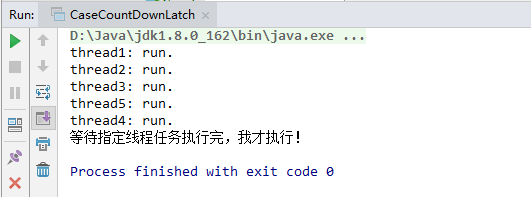
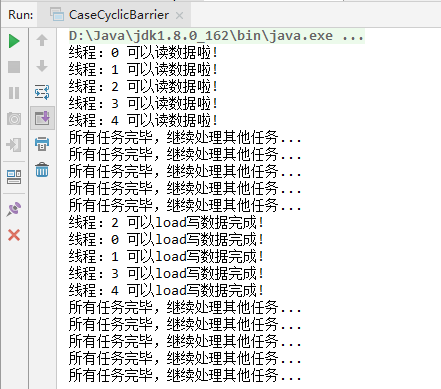

JDK并发包里（java.util.concurrent，简称 J.U.C）提供了几个非常有用的并发工具类。CountDownLatch、CyclicBarrier、Semaphore工具类提供了并发流程控制的能力，Exchanger工具类则提供了在线程间交换数据的一种手段。

# CountdownLatch

CountdownLatch 允许一个或多个线程等待其它线程执行完成操作。

利用它可以实现类似计数器的功能。 比如有一个任务 A，它要等待其他 4 个任务执行完毕之后才能执行，此时就可以利用 CountDownLatch 来实现这种功能了。 

维护了一个计数器 cnt，每次调用 countDown() 方法会让计数器的值减 1，减到 0 的时候，那些因为调用 await() 方法而在等待的线程就会被唤醒。 

CountDownLatch 类只提供了一个构造器： 

```
// 参数count为计数值
public CountDownLatch(int count) {
     if (count < 0) throw new IllegalArgumentException("count < 0");
     this.sync = new Sync(count);
} 
```

所以我们应用的话，只需要传入需要执行的任务数即可，如下代码：

```
public class CaseCountDownLatch {

    public static void main(String[] args) throws InterruptedException {
        // 线程计数器
        CountDownLatch countDownLatch = new CountDownLatch(5);

        for (int i = 0; i < 5; i++) {
            String threadName = "thread"+(i+1);
            new Thread(new Runnable() {
                @Override
                public void run() {
                    System.out.println(Thread.currentThread().getName()+": run.");
                    countDownLatch.countDown();
                }
            },threadName).start();
        }

        countDownLatch.await();
        System.out.println("等待指定线程任务执行完，我才执行！");
    }
}
```

运行结果：



代码中创建了计数器为5的 countDownLatch 对象，所以在5个线程执行完后才运行main函数的主线程，输出等`待指定线程任务执行完，我才执行！` ，因为 `countDownLatch.await();` 的缘故，线程被阻塞，需要等待指定数量的线程任务执行完 `countDown()` 后才不再被阻塞。

此工具类适用于需要异步任务请求的场景，以及多个任务线程执行计算结果，然后主线程汇总结果的场景等。

# CyclicBarrier

同步屏障 CyclicBarrier。

CyclicBarrier的字面意思是可循环使用的屏障。它的能力是，让一组线程到达一个屏障时被阻塞，知道最后一个线程到达屏障时，屏障才会开门，所有被屏障拦截的线程才会继续运行。

和 CountdownLatch 相似，都是通过维护计数器来实现的。 但是它的计数器是递增的，每次执行 await() 方法之后，计数器会加 1，直到计数器的值和设置的值相等，等待的所有线程才会继续执行。  

如下代码示例，模拟读写数据的场景，即所有数据准备完毕后，写线程才可以执行：

```
private static CyclicBarrier cyclicBarrier;

public static class PrepareReadDataThread extends Thread{
    private int id;

    PrepareReadDataThread(int id) {
        this.id = id;
    }

    @Override
    public void run() {
        try {
            System.out.println("线程：" + this.id + " 可以读数据啦!");
            cyclicBarrier.await();
        } catch (Exception e) {
            e.printStackTrace();
        }
        System.out.println("所有任务完毕，继续处理其他任务... ");
    }
}

public static class PrepareWriteDataThread extends Thread {
    private int id;

    PrepareWriteDataThread(int id) {
        this.id = id;
    }

    public void run() {
        try {
            Thread.sleep(3000);
            System.out.println("线程：" + this.id + " 可以load写数据完成!");
            cyclicBarrier.await();
        } catch (Exception e) {
            e.printStackTrace();
        }
        System.out.println("所有任务完毕，继续处理其他任务... ");
    }
}

public static void main(String[] args){
	// 创建数量5的同步屏障
    cyclicBarrier = new CyclicBarrier(5);
    for (int i = 0; i < 5; i++) {
        new PrepareReadDataThread(i).start();
    }
    //重置一下
    cyclicBarrier.reset();

    for (int i = 0; i < 5; i++) {
        new PrepareWriteDataThread(i).start();
    }
}
```

运行结果：



## CyclicBarrier 应用场景

CyclicBarrier 可以用于多线程计算数据，最后合并计算结果的场景。

CyclicBarrier 与 CountdownLatch 的主要区别是，CountdownLatch 计数器只能使用一次，而CyclicBarrier 的计数器可以循环使用，所以它才叫做循环屏障，能处理更为复杂的业务场景。

例如，如果计算发生错误，可以重置计数器，并让线程重新执行一次。

# Semaphore

Semaphore（信号量）是用来控制同时访问特定资源的线程数量，通过 acquire() 获取一个许可，如果没有就等待，而 release() 释放一个许可，以保证合理的使用公共资源。

示例：

```
public class CaseSemaphore {
    // 定义线程数量
    private static final int THREAD_COUNT = 50;
    // 创建固定数量的线程池
    private static ExecutorService threadPool = Executors.newFixedThreadPool(THREAD_COUNT);
    // 创建并发控制器(10)
    private static Semaphore semaphore = new Semaphore(10);

    public static void main(String[] args){
        for(int i=0;i<THREAD_COUNT;i++){
            threadPool.execute(new Runnable() {
                @Override
                public void run() {
                    try {
                        semaphore.acquire();
                        Thread.sleep(500);
                        System.out.println("run thread "+Thread.currentThread().getName());
                        semaphore.release();
                    } catch (InterruptedException e) {
                        e.printStackTrace();
                    }
                }
            });
        }
        threadPool.shutdown();
    }
}
```

代码执行结果：

```
run thread pool-1-thread-2
run thread pool-1-thread-1
run thread pool-1-thread-3
run thread pool-1-thread-4
run thread pool-1-thread-5
run thread pool-1-thread-7
run thread pool-1-thread-6
run thread pool-1-thread-8
run thread pool-1-thread-9
run thread pool-1-thread-10
run thread pool-1-thread-11
run thread pool-1-thread-12
run thread pool-1-thread-13
run thread pool-1-thread-14
run thread pool-1-thread-15
run thread pool-1-thread-16
run thread pool-1-thread-17
run thread pool-1-thread-20
run thread pool-1-thread-19
run thread pool-1-thread-18
run thread pool-1-thread-21
run thread pool-1-thread-22
run thread pool-1-thread-23
run thread pool-1-thread-24
run thread pool-1-thread-25
run thread pool-1-thread-26
run thread pool-1-thread-27
run thread pool-1-thread-30
run thread pool-1-thread-29
run thread pool-1-thread-28
run thread pool-1-thread-31
run thread pool-1-thread-34
run thread pool-1-thread-32
run thread pool-1-thread-33
run thread pool-1-thread-36
run thread pool-1-thread-35
run thread pool-1-thread-37
run thread pool-1-thread-39
run thread pool-1-thread-40
run thread pool-1-thread-38
run thread pool-1-thread-41
run thread pool-1-thread-44
run thread pool-1-thread-42
run thread pool-1-thread-43
run thread pool-1-thread-48
run thread pool-1-thread-46
run thread pool-1-thread-47
run thread pool-1-thread-50
run thread pool-1-thread-49
run thread pool-1-thread-45
```

由于是限流执行任务，所以每次线程池内最多同时执行了10个线程任务。

Semaphore 还提供了一些其他方法：

- availablePermits() ：返回此信号量中当前可用的许可证数量。
- getQueueLength()：返回正在等待许可证的线程数。

## 应用场景

基于这样的特性，我们很容易想到的功能就是限流。比如用于做流量控制啊，特别是公用资源有限的应用场景，如数据库连接等。

# 总结

关于这几个工具类，灵活运用可以在线程并发的场景中作为很不错的利器，看源码部分可知道，底层都是基于一种数据结构来实现的，即 AbstractQueuedSynchronizer （简称 AQS），它是一种同步队列，详细的原理分析需要单独一篇文章来描述了。

AQS 原理