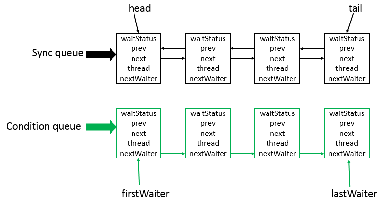

# AQS 原理分析

J.U.C 包下有很多并发工具，诸如CountdownLatch 、CyclicBarrier、Semaphore、ReentrantLock 等，底层原理都是基于 AbstractQueuedSynchronizer 实现的，即 **队列同步器**，简称为 AQS。

例如查看 CountdownLatch 的源码可以看到，构造方法内部实现了内部静态类 Sync 的实例：

```
private static final class Sync extends AbstractQueuedSynchronizer {
    private static final long serialVersionUID = 4982264981922014374L;

    Sync(int count) {
        setState(count);
    }

    int getCount() {
        return getState();
    }

    protected int tryAcquireShared(int acquires) {
        return (getState() == 0) ? 1 : -1;
    }

    protected boolean tryReleaseShared(int releases) {
        // Decrement count; signal when transition to zero
        for (;;) {
            int c = getState();
            if (c == 0)
                return false;
            int nextc = c-1;
            if (compareAndSetState(c, nextc))
                return nextc == 0;
        }
    }
}

public void await() throws InterruptedException {
	sync.acquireSharedInterruptibly(1);
}

public void countDown() {
	sync.releaseShared(1);
}
// 省略其它源码...
```

其 Sync 内部类继承了 AbstractQueuedSynchronizer，AQS 被认为是 J.U.C 的核心。它提供了一个基于 FIFO 队列，这个队列可以用来构建锁或者其他相关的同步装置的基础框架。

使用了 int 变量 state 来标识同步状态：

```
/**
 * The synchronization state.
 */
private volatile int state;
```


下图是AQS 底层的数据结构： 

 

它底层使用的是双向列表，是队列的一种实现 , 因此也可以将它当成一种队列。

- Sync queue 是同步列表，它是双向列表 , 包括 head，tail 节点。其中 head 节点主要用来后续的调度 ;
- Condition queue 是单向链表 , 不是必须的 , 只有当程序中需要 Condition 的时候，才会存在这个单向链表 , 并且可能会有多个 Condition queue。

简单的来说：

- AQS其实就是一个可以给我们实现锁的**框架**
- 内部实现的关键是：**先进先出的队列、state 状态**
- 定义了内部类 ConditionObject
- 拥有两种线程模式
- - 独占模式
  - 共享模式
- 在 LOCK 包中的相关锁（常用的有 ReentrantLock、 ReadWriteLock ）都是基于 AQS 来构建
- 一般我们叫 AQS 为同步器。

