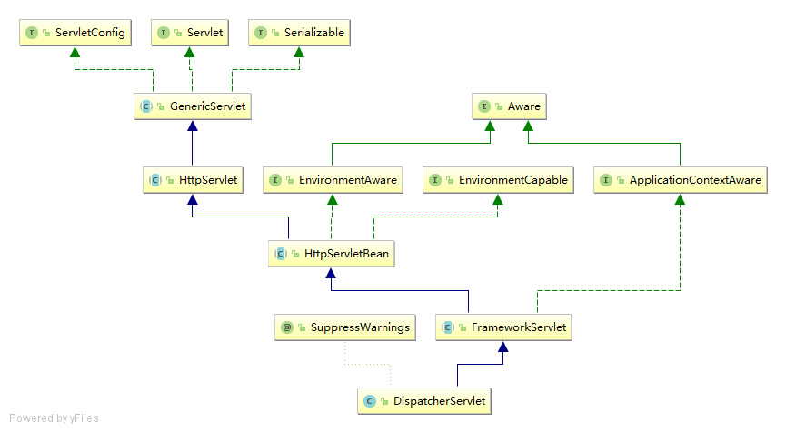
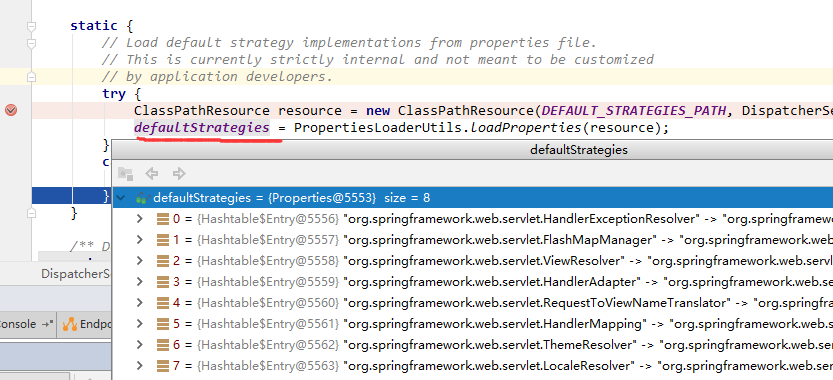

# SpringMVC初始化过程解读

spring-mvc的核心便是DispatcherServlet，所以初始化也是围绕其展开的。类图: 



## 加载默认策略

DispatcherServlet 初始化时，执行了静态代码块，初始化配置信息：

```
static {
   // Load default strategy implementations from properties file.
   // This is currently strictly internal and not meant to be customized
   // by application developers.
   try {
      ClassPathResource resource = new ClassPathResource(DEFAULT_STRATEGIES_PATH, DispatcherServlet.class);
      defaultStrategies = PropertiesLoaderUtils.loadProperties(resource);
   }
   catch (IOException ex) {
      throw new IllegalStateException("Could not load '" + DEFAULT_STRATEGIES_PATH + "': " + ex.getMessage());
   }
}
```

其中 DEFAULT_STRATEGIES_PATH 常量默认值为 DispatcherServlet.properties，在源码里可以看见文件信息如下：

```
# Default implementation classes for DispatcherServlet's strategy interfaces.
# Used as fallback when no matching beans are found in the DispatcherServlet context.
# Not meant to be customized by application developers.

org.springframework.web.servlet.LocaleResolver=org.springframework.web.servlet.i18n.AcceptHeaderLocaleResolver

org.springframework.web.servlet.ThemeResolver=org.springframework.web.servlet.theme.FixedThemeResolver

org.springframework.web.servlet.HandlerMapping=org.springframework.web.servlet.handler.BeanNameUrlHandlerMapping,\
   org.springframework.web.servlet.mvc.method.annotation.RequestMappingHandlerMapping

org.springframework.web.servlet.HandlerAdapter=org.springframework.web.servlet.mvc.HttpRequestHandlerAdapter,\
   org.springframework.web.servlet.mvc.SimpleControllerHandlerAdapter,\
   org.springframework.web.servlet.mvc.method.annotation.RequestMappingHandlerAdapter

org.springframework.web.servlet.HandlerExceptionResolver=org.springframework.web.servlet.mvc.method.annotation.ExceptionHandlerExceptionResolver,\
   org.springframework.web.servlet.mvc.annotation.ResponseStatusExceptionResolver,\
   org.springframework.web.servlet.mvc.support.DefaultHandlerExceptionResolver

org.springframework.web.servlet.RequestToViewNameTranslator=org.springframework.web.servlet.view.DefaultRequestToViewNameTranslator

org.springframework.web.servlet.ViewResolver=org.springframework.web.servlet.view.InternalResourceViewResolver

org.springframework.web.servlet.FlashMapManager=org.springframework.web.servlet.support.SessionFlashMapManager
```

主要定义了spring-mvc的默认策略，启动调试时可以看到，默认策略对象被初始化，默认加载属性文件则是DispatcherServlet.properties，如下图：



## 初始化容器及策略

Servlet标准定义了init方法是其生命周期的初始化方法。

HttpServletBean.init:

```
/**
 * Map config parameters onto bean properties of this servlet, and
 * invoke subclass initialization.
 * @throws ServletException if bean properties are invalid (or required
 * properties are missing), or if subclass initialization fails.
 */
@Override
public final void init() throws ServletException {
   if (logger.isDebugEnabled()) {
      logger.debug("Initializing servlet '" + getServletName() + "'");
   }

   // Set bean properties from init parameters.
   PropertyValues pvs = new ServletConfigPropertyValues(getServletConfig(), this.requiredProperties);
   if (!pvs.isEmpty()) {
      try {
         BeanWrapper bw = PropertyAccessorFactory.forBeanPropertyAccess(this);
         ResourceLoader resourceLoader = new ServletContextResourceLoader(getServletContext());
         bw.registerCustomEditor(Resource.class, new ResourceEditor(resourceLoader, getEnvironment()));
         initBeanWrapper(bw);
         bw.setPropertyValues(pvs, true);
      }
      catch (BeansException ex) {
         if (logger.isErrorEnabled()) {
            logger.error("Failed to set bean properties on servlet '" + getServletName() + "'", ex);
         }
         throw ex;
      }
   }

   // Let subclasses do whatever initialization they like.
   initServletBean();

   if (logger.isDebugEnabled()) {
      logger.debug("Servlet '" + getServletName() + "' configured successfully");
   }
}
```

将此配置参数映射到该servlet的bean属性，以及调用子类初始化。如果bean属性无效（或需要），则抛出Servlet异常属性丢失，或者子类初始化失败。

注意这里的 HttpServletBean是父类，initServletBean()是一个接口方法，调用时执行 FrameworkServlet 子类的initServletBean()方法：

```
/**
 * Overridden method of {@link HttpServletBean}, invoked after any bean properties
 * have been set. Creates this servlet's WebApplicationContext.
 */
@Override
protected final void initServletBean() throws ServletException {
   getServletContext().log("Initializing Spring FrameworkServlet '" + getServletName() + "'");
   if (this.logger.isInfoEnabled()) {
      this.logger.info("FrameworkServlet '" + getServletName() + "': initialization started");
   }
   long startTime = System.currentTimeMillis();

   try {
      this.webApplicationContext = initWebApplicationContext();
      initFrameworkServlet();
   }
   catch (ServletException | RuntimeException ex) {
      this.logger.error("Context initialization failed", ex);
      throw ex;
   }

   if (this.logger.isInfoEnabled()) {
      long elapsedTime = System.currentTimeMillis() - startTime;
      this.logger.info("FrameworkServlet '" + getServletName() + "': initialization completed in " +
            elapsedTime + " ms");
   }
}
```

源码中可以看到，会给spring web容器属性进行初始化，然后再初始化当前Servlet。

执行 initWebApplicationContext：

```
protected WebApplicationContext initWebApplicationContext() {
   WebApplicationContext rootContext =
         WebApplicationContextUtils.getWebApplicationContext(getServletContext());
   WebApplicationContext wac = null;

   if (this.webApplicationContext != null) {
      // A context instance was injected at construction time -> use it
      wac = this.webApplicationContext;
      if (wac instanceof ConfigurableWebApplicationContext) {
         ConfigurableWebApplicationContext cwac = (ConfigurableWebApplicationContext) wac;
         if (!cwac.isActive()) {
            // The context has not yet been refreshed -> provide services such as
            // setting the parent context, setting the application context id, etc
            if (cwac.getParent() == null) {
               // The context instance was injected without an explicit parent -> set
               // the root application context (if any; may be null) as the parent
               cwac.setParent(rootContext);
            }
            configureAndRefreshWebApplicationContext(cwac);
         }
      }
   }
   if (wac == null) {
      // No context instance was injected at construction time -> see if one
      // has been registered in the servlet context. If one exists, it is assumed
      // that the parent context (if any) has already been set and that the
      // user has performed any initialization such as setting the context id
      wac = findWebApplicationContext();
   }
   if (wac == null) {
      // No context instance is defined for this servlet -> create a local one
      wac = createWebApplicationContext(rootContext);
   }

   if (!this.refreshEventReceived) {
      // Either the context is not a ConfigurableApplicationContext with refresh
      // support or the context injected at construction time had already been
      // refreshed -> trigger initial onRefresh manually here.
      onRefresh(wac);
   }

   if (this.publishContext) {
      // Publish the context as a servlet context attribute.
      String attrName = getServletContextAttributeName();
      getServletContext().setAttribute(attrName, wac);
      if (this.logger.isDebugEnabled()) {
         this.logger.debug("Published WebApplicationContext of servlet '" + getServletName() +
               "' as ServletContext attribute with name [" + attrName + "]");
      }
   }
   return wac;
}
```

首先通过 WebApplicationContextUtils工具类创建一个web容器实例，然后往下执行，判断是否接收刷新事件，进入 onRefresh(wac)方法，这个方法是在子类 DispatcherServlet中实现的：

```
/**
 * This implementation calls {@link #initStrategies}.
 */
@Override
protected void onRefresh(ApplicationContext context) {
   initStrategies(context);
}
```

这样就进入是初始化策略方法，其参数是当前 容器实例：

```
/**
 * Initialize the strategy objects that this servlet uses.
 * <p>May be overridden in subclasses in order to initialize further strategy objects.
 */
protected void initStrategies(ApplicationContext context) {
   initMultipartResolver(context);
   initLocaleResolver(context);
   initThemeResolver(context);
   initHandlerMappings(context);
   initHandlerAdapters(context);
   initHandlerExceptionResolvers(context);
   initRequestToViewNameTranslator(context);
   initViewResolvers(context);
   initFlashMapManager(context);
}
```

这里分别初始化了9个组件：

1. initMultipartResolver，附件上传服务；
2. initLocaleResolver，用于处理国际化问题，通过解析请求的Locale和设置相应的Locale来控制应用中的字符编码问题；
3. initThemeResolver，用于定义一个主题；
4. initHandlerMappings，用于定义我们设置的请求URI映射关系；
5. initHandlerAdapters，根据Handler的类型定义不同的处理规则；
6. initHandlerExceptionResolvers，Handler异常处理，当Handler出错时，会通过这个Handler来统一处理；
7. initRequestToViewNameTranslator，将制定的ViewName按照定义的RequestToViewNameTranslator替换成想要的格式，例如加上前缀或者后缀等；
8. initViewResolvers，用于将View解析成页面；
9. initFlashMapManager，FlashMap继承自HashMap，除了用于HashMap的功能和设置有效期，还可以保存Redirect后的目标路径和通过url传递的参数。

从上面的初始化策略可以知道，在一个请求中可能需要我们来扩展的地方都定义了扩展点，只要实现相应的接口类，并创建一个SpringBean就能扩展SpringMVC框架。

其中，有3个组件是我们必须要定义和扩展的：

- 定义URL映射规则
- 实现业务逻辑的Handler实例对象
- 渲染模板资源

连接Handler实例兑现和模板渲染的纽带就是Model模型了。

这时DispatcherServlet已经初始化完成，SpringMVC也已经初始化完成，可以接受我们的HTTP请求了。