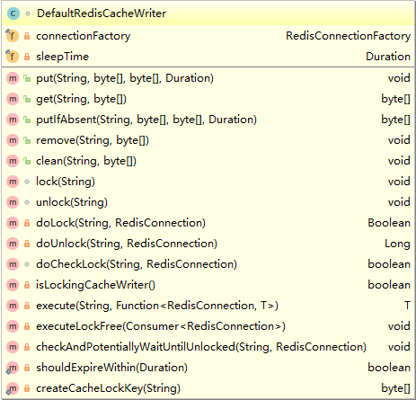

Spring为我们提供了几个注解来支持缓存。其核心注解包括：@Cacheable、@CachePut、@CacheEvict。

@Cacheable标记的方法在执行后Spring Cache将缓存其返回结果，而使用@CacheEvict标记的方法会在方法执行前或者执行后移除Spring Cache中的某些元素。 

## 配置Redis缓存的支持

### Maven依赖

在pom.xml中，增加：

```
<dependency>
    <groupId>org.springframework.boot</groupId>
    <artifactId>spring-boot-starter-data-redis</artifactId>
</dependency>
<dependency>
    <groupId>org.springframework.boot</groupId>
    <artifactId>spring-boot-starter-cache</artifactId>
</dependency>
```

### Bean配置

具体配置如下：

```
import com.fasterxml.jackson.annotation.JsonAutoDetect;
import com.fasterxml.jackson.annotation.PropertyAccessor;
import com.fasterxml.jackson.databind.ObjectMapper;
import org.springframework.boot.autoconfigure.AutoConfigureAfter;
import org.springframework.boot.autoconfigure.cache.CacheProperties;
import org.springframework.boot.autoconfigure.data.redis.RedisAutoConfiguration;
import org.springframework.boot.context.properties.EnableConfigurationProperties;
import org.springframework.cache.CacheManager;
import org.springframework.cache.annotation.CachingConfigurerSupport;
import org.springframework.cache.interceptor.KeyGenerator;
import org.springframework.context.annotation.Bean;
import org.springframework.context.annotation.Configuration;
import org.springframework.data.redis.cache.CacheKeyPrefix;
import org.springframework.data.redis.cache.RedisCacheConfiguration;
import org.springframework.data.redis.cache.RedisCacheManager;
import org.springframework.data.redis.cache.RedisCacheWriter;
import org.springframework.data.redis.connection.RedisConnectionFactory;
import org.springframework.data.redis.core.RedisTemplate;
import org.springframework.data.redis.serializer.*;
import java.time.Duration;
import java.util.HashMap;
import java.util.Map;

/**
 * redis 配置
 */
@Configuration
@AutoConfigureAfter(RedisAutoConfiguration.class)
@EnableConfigurationProperties(CacheProperties.class)
public class RedisConfig extends CachingConfigurerSupport {

   /**
    * Redis模板 默认序列化方式
    * @param factory
    * @return
    */
   @Bean
   public RedisTemplate<String, Object> redisTemplate(RedisConnectionFactory factory) {

      RedisTemplate<String, Object> template = new RedisTemplate<>();
      RedisSerializer<String> redisSerializer = new StringRedisSerializer(); //key序列化
      template.setConnectionFactory(factory);

      //key序列化方式
      template.setKeySerializer(redisSerializer);

      template.afterPropertiesSet();
      return template;
   }

   /**
    * Redis模板 Jackson2 序列化方式
    * @param factory
    * @return
    */
   @Bean(name = "redisTemplateJackson")
   public RedisTemplate<String, Object> redisTemplateJackson(RedisConnectionFactory factory) {
      RedisTemplate<String, Object> template = new RedisTemplate<>();
      RedisSerializer<String> redisSerializer = new StringRedisSerializer(); //key序列化
      template.setConnectionFactory(factory);

      //key序列化方式
      template.setKeySerializer(redisSerializer);
      //value序列化
      template.setDefaultSerializer(new Jackson2JsonRedisSerializer<>(Object.class));

      template.afterPropertiesSet();
      return template;
   }

   @Bean
   public CacheManager cacheManager(RedisConnectionFactory redisConnectionFactory) {
      return new RedisCacheManager(
         RedisCacheWriter.nonLockingRedisCacheWriter(redisConnectionFactory),
         // 默认策略，未配置的 key 会使用这个
         this.getRedisCacheConfigurationWithTtl(30),
         // 指定 key 策略
         this.getRedisCacheConfigurationMap()
      );
   }

   /**
    * 指定不同key的缓存策略
    * @return
    */
   private Map<String, RedisCacheConfiguration> getRedisCacheConfigurationMap() {
      Map<String, RedisCacheConfiguration> redisCacheConfigurationMap = new HashMap<>();
      // 菜单json树缓存
      redisCacheConfigurationMap.put("string:menu-tree", this.getRedisCacheConfigurationWithTtl(600));
      // 数据字典缓存
      redisCacheConfigurationMap.put("string:data-dictionary", this.getRedisCacheConfigurationWithTtl(600));

      return redisCacheConfigurationMap;
   }

   /**
    * 默认key的缓存策略
    * @param minutes
    * @return
    */
   private RedisCacheConfiguration getRedisCacheConfigurationWithTtl(Integer minutes) {
      Jackson2JsonRedisSerializer<Object> jackson2JsonRedisSerializer = new Jackson2JsonRedisSerializer<>(Object.class);

      // 配置对象映射
      ObjectMapper om = new ObjectMapper();
      om.setVisibility(PropertyAccessor.ALL, JsonAutoDetect.Visibility.ANY);
      om.enableDefaultTyping(ObjectMapper.DefaultTyping.NON_FINAL);
      jackson2JsonRedisSerializer.setObjectMapper(om);

      // Redis 缓存设置
      RedisCacheConfiguration redisCacheConfiguration = RedisCacheConfiguration.defaultCacheConfig();

      redisCacheConfiguration = redisCacheConfiguration.serializeValuesWith(
            RedisSerializationContext
                  .SerializationPair
                  .fromSerializer(jackson2JsonRedisSerializer)
      ).entryTtl(Duration.ofMinutes(minutes));

      // 自定义前缀 (:一个冒号)
      redisCacheConfiguration = redisCacheConfiguration.computePrefixWith(myKeyPrefix());

      return redisCacheConfiguration;
   }

   /**
    * key 生成
    * @return
    */
   @Bean
   public KeyGenerator simpleKeyGenerator() {
      return (o, method, objects) -> {
         StringBuilder stringBuilder = new StringBuilder();
         stringBuilder.append(o.getClass().getSimpleName());
         stringBuilder.append(".");
         stringBuilder.append(method.getName());
         stringBuilder.append("[");
         for (Object obj : objects) {
            stringBuilder.append(obj.toString());
         }
         stringBuilder.append("]");
         String build = stringBuilder.toString();
         return build;
      };
   }

   /**
    * 缓存前缀（追加一个冒号 : ）
    * @return
    */
   private CacheKeyPrefix myKeyPrefix(){
      return name -> name + ":";
   }
}
```

其中，主要是配置CacheManager，里面分别对不同的缓存key，配置不同的过期策略，比如某些 key 需要较长时间过期，某些 key 可能较短时间过期，那么就分别进行配置，加入到map中即可。

## 注解使用

### @Cacheable

注解参数：

| 属性名    | 必填 | 描述                                                  |
| --------- | ---- | ----------------------------------------------------- |
| value     | Y    | 缓存的命名空间                                        |
| key       | N    | 指定一个唯一的key（在缓存命名空间中），使用SpEL表达式 |
| condition | N    | 限定条件，哪种情况使用缓存，使用SpEL表达式            |
| unless    | N    | 限定条件，哪种情况下不使用缓存，使用SpEL表达式        |

下面是列举一些各种缓存的形式：

1.基本形式：

```
@Cacheable(value="cacheName", key"#id")
public ResultDTO method(int id); 
```

2.组合形式 ：

```
@Cacheable(value="string:menu-tree-json",
        key = "'['+T(String).valueOf(#mode).concat('-').concat(#roleId)+']'")
@Override
public String getTreeJson(int mode,long roleId);
```

3.多个参数拼接 ：

```
@Cacheable(value = "findByUsernameAndTypeCached", key = "#username + '_' + #type")
public User findByUsernameAndTypeCached(String username, Integer type); 
```

4.复杂参数（数组） ：

```
@Cacheable(value = "findByUserIdsCached", key = "#userIds[0] + ''")
public User findByUserIdsCached(Integer[] userIds)；
```

5.对象形式：

```
@Cacheable(value="cacheName", key"#user.id)
public ResultDTO method(User user); 
```

6.自定义key：

```
@Cacheable(value="gomeo2oCache", keyGenerator = "keyGenerator")
public ResultDTO method(User user); 
```

另外，Spring默认提供了EL表达式获取一些值：

| 属性        | 描述                        | 示例                 |
| ----------- | --------------------------- | -------------------- |
| methodName  | 当前方法名                  | #root.methodName     |
| method      | 当前方法                    | #root.method.name    |
| target      | 当前被调用的对象            | #root.target         |
| targetClass | 当前被调用的对象的class     | #root.targetClass    |
| args        | 当前方法参数数组            | #root.args[0]        |
| caches      | 当前被调用的方法使用的Cache | #root.caches[0].name |

### @CachePut

此注解和@Cacheable 使用上是一样的，区别是，@CachePut 注解声明后，每次都存储到缓存，而@Cacheable 则会先检查是否存在，如果不存在才进行缓存数。

### @CacheEvict

缓存清除注解，标记在类或方法上执行都会触发缓存的清除操作。 @CacheEvict可以指定的属性有value、key、condition、allEntries和beforeInvocation。其中value、key和condition的语义与@Cacheable对应的属性类似。即value表示清除操作是发生在哪些Cache上的（对应Cache的名称）；key表示需要清除的是哪个key，如未指定则会使用默认策略生成的key；condition表示清除操作发生的条件。下面我们来介绍一下新出现的两个属性allEntries和beforeInvocation。  

## 缓存源码解读

### 缓存初始化

Spring的中央缓存管理器在配置文件中可以得知，位于 org.springframework.cache.CacheManager：

```
public interface CacheManager {
   @Nullable
   Cache getCache(String name);

   Collection<String> getCacheNames();
}
```

CacheManager是Spring缓存的中央管理器，它的成员方法很简单，一个是获取缓存对象Cache，一个是获取缓存名称的集合，集合就是String的列表，那么在看一下Cache的方法：


接口一共定义了9个方法，都是对缓存进行存、查、清除等操作，一目了然。

因此我们所有缓存实现都要实现CacheManager接口，这里我们以Redis缓存为例分析，在配置CacheManager Bean中我们返回的是RedisCacheManager，来看一下类图：


可以看到 RedisCacheManager 继承了 AbstractTransactionSupportingCacheManager ，而AbstractTransactionSupportingCacheManager 继承了 AbstractCacheManager ，最后 AbstractCacheManager 实现了 CacheManager 和 InitializingBean 接口。

我们已知道CacheManager是缓存管理器，主要作用是获得缓存，那么InitializingBean 接口主要作用是初始化Spring的Bean，里面只有一个方法：`void afterPropertiesSet() throws Exception;`，执行时机是BeanFactory在设置了提供的所有bean属性之后调用。

接下来看下 AbstractCacheManager ，它是抽象缓存管理器，主要作用是对缓存管理器和初始化进行了默认的实现，看一下此了的主要方法：

```
public abstract class AbstractCacheManager implements CacheManager, InitializingBean {

   private final ConcurrentMap<String, Cache> cacheMap = new ConcurrentHashMap<>(16);

   private volatile Set<String> cacheNames = Collections.emptySet();

   // Early cache initialization on startup

   @Override
   public void afterPropertiesSet() {
      initializeCaches();
   }
   
   public void initializeCaches() {
		Collection<? extends Cache> caches = loadCaches();

		synchronized (this.cacheMap) {
			this.cacheNames = Collections.emptySet();
			this.cacheMap.clear();
			Set<String> cacheNames = new LinkedHashSet<>(caches.size());
			for (Cache cache : caches) {
				String name = cache.getName();
				this.cacheMap.put(name, decorateCache(cache));
				cacheNames.add(name);
			}
			this.cacheNames = Collections.unmodifiableSet(cacheNames);
		}
	}
	
	protected abstract Collection<? extends Cache> loadCaches();
	
	@Override
	@Nullable
	public Cache getCache(String name) {
		Cache cache = this.cacheMap.get(name);
		if (cache != null) {
			return cache;
		}
		else {
			// Fully synchronize now for missing cache creation...
			synchronized (this.cacheMap) {
				cache = this.cacheMap.get(name);
				if (cache == null) {
					cache = getMissingCache(name);
					if (cache != null) {
						cache = decorateCache(cache);
						this.cacheMap.put(name, cache);
						updateCacheNames(name);
					}
				}
				return cache;
			}
		}
	}
	
	@Deprecated
	protected final void addCache(Cache cache) {
		String name = cache.getName();
		synchronized (this.cacheMap) {
			if (this.cacheMap.put(name, decorateCache(cache)) == null) {
				updateCacheNames(name);
			}
		}
	}
	
	// 省略部分源码......
}
```

首先是实现了 afterPropertiesSet 方法，调用了initializeCaches方法，作用是初始化静态配置文件中的缓存，可以看到此方法是线程安全的，使用了同步锁进行初始化，将loadCaches() 方法返回的集合添加到 cacheNames中，loadCaches()方法的实现在RedisCacheManager类中，可以看下方法：

```
// 加载所有配置的缓存到缓存集合中
@Override
protected Collection<RedisCache> loadCaches() {

   List<RedisCache> caches = new LinkedList<>();

   for (Map.Entry<String, RedisCacheConfiguration> entry : initialCacheConfiguration.entrySet()) {
      caches.add(createRedisCache(entry.getKey(), entry.getValue()));
   }

   return caches;
}
```

遍历的缓存集合是 initialCacheConfiguration，它是一个成员变量，在我们创建RedisCacheManager实例中，在构造器里赋予初始值。**到这里也就清楚了，我们自定义的@Bean，CacheManager传入的缓存Map的作用了。**

另外，AbstractCacheManager 抽象类的其它方法主要是 getCache 、和 addCache等，都是所用了同步锁进行对缓存进行获取和管理。

AbstractTransactionSupportingCacheManager 类实现了 AbstractCacheManager ，看下源码：

```
public abstract class AbstractTransactionSupportingCacheManager extends AbstractCacheManager {
   private boolean transactionAware = false;

   public void setTransactionAware(boolean transactionAware) {
      this.transactionAware = transactionAware;
   }

   public boolean isTransactionAware() {
      return this.transactionAware;
   }

   @Override
   protected Cache decorateCache(Cache cache) {
      return (isTransactionAware() ? new TransactionAwareCacheDecorator(cache) : cache);
   }
}
```

可以看出，它的核心功能就是对事务的支持，其默认情况下，是不支持事务的，因为 transactionAware 的默认值是 false，如果他们设置了为 true，那么将返回带有事务的 Cache对象。

### 缓存读写

接下来看下最底层的实现类 RedisCacheManager，即Redis缓存管理器，核心功能有2个：

- 缓存初始化（上面有提到）
- 提供我们的程序与 Redis 读写数据

这里看下是如何进行读写的，看下类图：


这个类提供了多种多样的构造器，供我们使用。另外很明显可以看出成员变量cacheWriter就是对缓存起到读写作用的，它的类型是 RedisCacheWriter接口：


里面主要定义了常用的缓存读写方法。其静态方法nonLockingRedisCacheWriter 和 lockingRedisCacheWriter，分别返回无锁和有锁的默认实现类 DefaultRedisCacheWriter：



此类主要有2个成员变量：

```
private final RedisConnectionFactory connectionFactory;
private final Duration sleepTime;
```

connectionFactory 是redis连接工厂，sleepTime即过期策略，默认的过期策略是 `Duration.ZERO`，也就是永久存储。

剩下的方法都是对缓存进行存取相关的，重点看下这个接口的实现接口：

```
public interface RedisConnection extends RedisCommands { // 省略... }
```

也就是RedisCommands，看下此接口源码，一眼看去，(๑ŐдŐ)b ，那么一大堆实现...

其实不用一一去具体看，都是对Redis各种数据类型、命令封装的接口，用到什么数据类型去使用里面的API就好了，可以参考Redis官网的API，这里面其实都是对官网Redis命令的封装而已，我们拿来就用即可。

```
public interface RedisCommands extends RedisKeyCommands, RedisStringCommands, RedisListCommands, RedisSetCommands,
      RedisZSetCommands, RedisHashCommands, RedisTxCommands, RedisPubSubCommands, RedisConnectionCommands,
      RedisServerCommands, RedisScriptingCommands, RedisGeoCommands, RedisHyperLogLogCommands {

   @Nullable
   Object execute(String command, byte[]... args);
}
```

比如进入RedisStringCommands这个接口：


有没有很熟悉，和Redis的命令几乎是对应的，^_^ .

好了，既然是命令接口，那么去找到相应的实现类，就可以观察我们缓存最终是在哪里进行执行的了。来看一下connection包：


可以看下这个包里面的两个子包，jedis 和 lettuce，也就是不同客户端的不同实现啦，由于我在用的是springboot2.x版本，其默认使用的是 lettuce 客户端实现的，所以我们可以去里面找到相应的实现类，LettuceStringCommands：

```
class LettuceStringCommands implements RedisStringCommands { //省略...... }
```

由于代码量过大，而且都是API，所以就不贴全部的源码了，看到这个类是实现了 RedisStringCommands 接口就明白了。

所以这里我设置了断点：


访问控制器，带有的注解，直接进入了断点：


往下调试 ..... 最后进入了CacheAspectSupport 类的 CachePutRequest 方法：


调试执行完成后（后面断点一直跳就不用理会了，重点部分调试完即可哈，不然没玩没了），可以看到数据已经保存到Redis中了：


缓存读的话，基本也是这个思路，后面有时间再补充吧。

另外，缓存写入时，SpringBoot2.x的默认前缀使用了两个 :: 冒号，在Redis客户端查看时很不方便，在RedisCacheConfiguration的构造方法可以看到：

```
public static RedisCacheConfiguration defaultCacheConfig() {

   DefaultFormattingConversionService conversionService = new DefaultFormattingConversionService();

   registerDefaultConverters(conversionService);

   return new RedisCacheConfiguration(Duration.ZERO, true, true, CacheKeyPrefix.simple(),
         SerializationPair.fromSerializer(new StringRedisSerializer()),
         SerializationPair.fromSerializer(new JdkSerializationRedisSerializer()), conversionService);
}
```

其中 CacheKeyPrefix.simple() 就是缓存前缀，点进去看一下：

```
static CacheKeyPrefix simple() {
   return name -> name + "::";
}
```

居然有两个 :: 有没有，多不方便看？？ 所以如果想用一个 ：的话，那么就自己实现了 CacheKeyPrefix 传入进去就可以了。如：

```
/**
 * 缓存前缀（追加一个冒号 : ）
 * @return
 */
private CacheKeyPrefix myKeyPrefix(){
   return name -> name + ":";
}
```


# 总结

基于Redis缓存的源码分析，可以得知