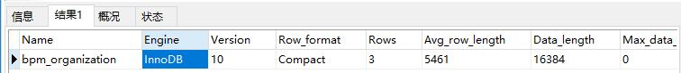

# InnoDB 存储引擎

InnoDB是MySQL默认事务性引擎，也是最重要、应用最广泛的存储引擎。它被设计用来处理大量的短期事务，短期事务大部分是正常提交的，很少会被回滚。InnoDB的性能和自动崩溃恢复特性，使得它在非事务型存储需求中也很流行。除非有非常特别的原因需要使用其他的存储引擎，否则应该优先考虑InnoDB引擎。

## InnoDB 历史

2008年发布了InnoDB plugin，适用于MySQL5.1版本，但这是甲骨文公司创建的下一代InnoDB引擎，其拥有者是InnoDB而不是MySQL。而MySQL数据库仍然使用旧版本的InnoDB引擎（非当前的InnoDB），当然用户可以自行选择使用新的、性能更好、扩展性更加的InnoDB plugin来覆盖旧的版本。

直到甲骨文公司收购了Sun公司之后，发布的MySQL5.5版本中才彻底使用InnoDB plugin替代了旧版本的InnoDB。这个现代的InnoDB版本，也就是MySQL5.1版本中的InnoDB plugin，支持一些新特性，诸如：利用排序创建索引、删除或增加索引时不需要复制全表数据、新的支持压缩的存储格式、新的大型列值（如 BLOB的存储方式），以及文件格式管理等。

## InnoDB 介绍

InnoDB的数据存储在表空间（tablespace）中，表空间是有InnoDB管理的一个黑盒子，有一系列的数据文件组成。InnoDB采用MVCC来支持高并发，并且实现了四个标准的隔离级别，其默认级别是 `REPEATEBLE READ` （可重复读），并且通过间隙锁策略防止幻读的出现。间隙锁使得InnoDB不仅仅锁定查询涉及的行，还会对索引中的间隙进行锁定，以防止幻影行的插入。

InnoDB表是基于聚集索引建立的。聚集索引对逐渐查询有很高的性能。不过它的二级索引（也就是非聚集索引）中必须包含主键列，所以如果主键列很大的话，其它的所有索引都会很大。因此，若表上的索引较多的话，主键列应当尽可能的小。InnoDB的存储格式是平台独立的，也就是说可以将数据和索引文件从Intel平台复制到PowerPC或者其它平台不受影响。

作为事务型的存储引擎，InnoDB通过一些机制和工具支持真正的热备份，Oracle提供的MySQL Enterprise Backup、Percona提供的开源的XtraBackup都一个做到这一点。相对其它类型的存储引擎并不支持热备份，要获取一致性视图需要停止对所有表的写入操作，而在读写混合场景中，停止写入也意味着停止读取。

# MyISAM 存储引擎

在MySQL5.1以前的版本中，MyISAM是默认的存储引擎。MyISAM提供了大量的特性，包括全文索引、压缩、空间函数等，但MyISAM不支持事务和行级锁，而且有一个毫无疑问的缺陷就是崩溃后无法安全恢复。尽管MyISAM不支持事务、不支持崩溃后的安全恢复，但它绝不是一无是处的。对于只读的数据，或者表比较小、可以忍受修复操作的数据，则依然可以使用MyISAM。

## 存储

MyISAM会将表存储在两个文件中，数据文件和索引文件，分别以 `.MYD` 和 `.MYI` 为扩展名。

## 特性

作为MySQL最早的存储引擎之一，MyISAM有一些已经开发出来很多年的特性，可以满足用户的实际需求。

### 加锁与并发

MyISAM对整张表进行加锁，而不是针对行。读取时会对需要读到的所有表加共享锁，写入时则对表加排它锁。但是在表有读取查询的同时，也可以往表中插入新的记录。

###修复 

对于MyISAM表，MySQL可以手工或者自动执行检查和修复操作，但这里说的修复和事务恢复以及崩溃恢复是不同的概念。执行表的修复可能会导致一些数据丢失，而且修复操作也是非常慢的。可以通过 `check table myTable` 检查表的错误，如果有错误可以通过执行 `repair table myTable` 进行修复。

### 索引特性

对于MyISAM表，即使是 BLOB 和 TEXT 等长字段，也可以基于其前500个字符创建索引。同时MyISAM也支持全文索引，这是一种基于分词创建的索引，可以支持复杂的查询。

### 延迟更新索引

创建MyISAM表的时候如果指定了 DELAY_KEY_WRITE选项，在每次修改执行完成时，不会立刻将修改的索引数据写入磁盘，而是会写到内存中的键缓冲区（in-memory key buffer），只有在清理键缓冲区或者关闭表的时候才会将对应的索引块写入磁盘。这种方式极大地提升了写入的性能，但是在数据库主机崩溃时会造成索引损坏，需要执行修复操作。

## MyISAM压缩表

如果表在创建并导入数据之后，不会再进行修改操作，那么这样的表获取适合采用MyISAM压缩表。

可以使用 `myisampack` 对MyISAM进行压缩。压缩表示不能进行修改的。压缩表可以极大第减少磁盘空间占用，因此也可以减少磁盘I/O，从而提升查询性能。压缩表也支持索引，但索引也是只读的哦！

## MyISAM性能

MyISAM引擎设计简单，数据以紧密格式存储，所以在某些场景下的性能很好。MyISAM有一些服务器的性能扩展限制，比如对索引键缓冲区的Mutex锁。但MyISAM最典型的性能问题还是表锁的问题，如果你发现所有的查询都长期处于 “Locked” 状态，那么毫无疑问表锁就是罪魁祸首。

# MySQL内建其它引擎

## Archive引擎

Archive存储引擎只支持 insert 和 select 操作，在MySQL5.1版本之前也不支持。Archive引擎会缓存所有的写并利用zlib对插入的行进行压缩，所以比MyISAM表的磁盘I/O更少。但是每次 select 查询都需要执行全表扫描。所以Archive表适合日志和数据采集类应用，这类应用做数据分析时往往需要全表扫描。或者在一些需要更快速的 insert 操作的场景下也可以使用。

## Memory引擎

如果需要快速地访问数据，并且这些数据不会被修改，重启以后丢失也没有关系，那么使用Memory表是非常有用的。Memory表至少比MyISAM表要快一个数量级，因为所有数据都保存在内存中，不需要进行磁盘I/O。由于存储在内存中，所以重启后数据都会丢失，但是表结构会被保留。

# 查看引擎

使用SHOW TABLE STATUS 命令显示表相关的信息，可以查看表的存储引擎。

如：`show table status like 'bpm_organization'`，可以查看表的Engine等信息。

# 选择合适的引擎

这么多存储引擎，我们怎么选择呢？大部分情况下，InnoDB都是正确的选择，所以甲骨文在MySQL5.5版本时将 InnoDB作为默认的存储引擎了。对于如果选择存储引擎可以简单地归纳为：“除非需要用到某些InnoDB不具备的特性，并且没有其他办法可以替代，否则都应该优先选择InnoDB引擎”。